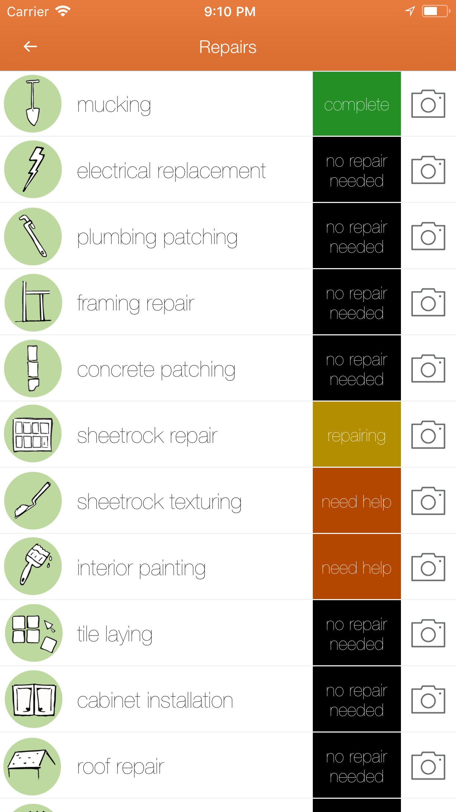
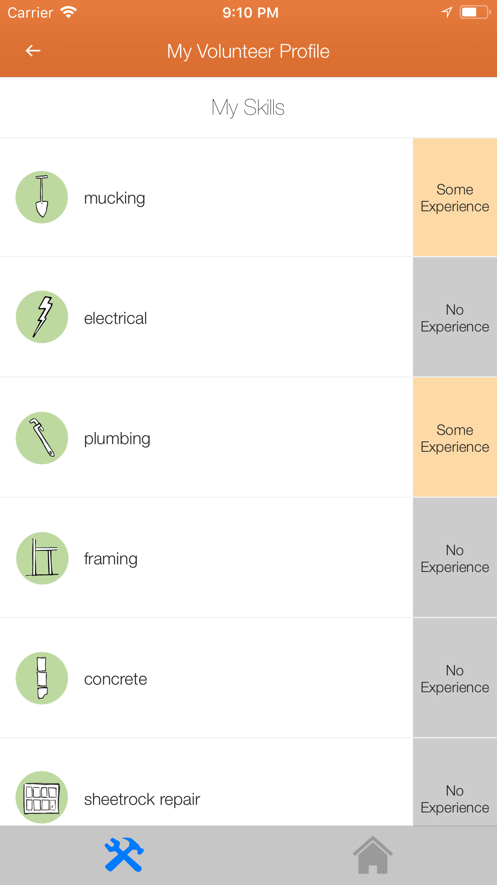
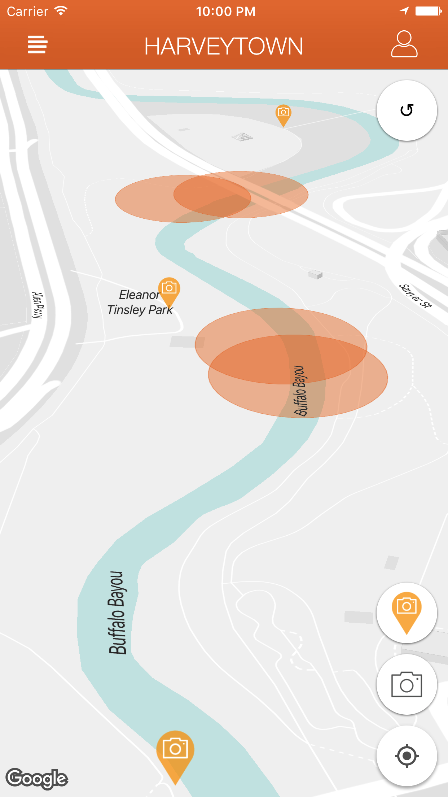
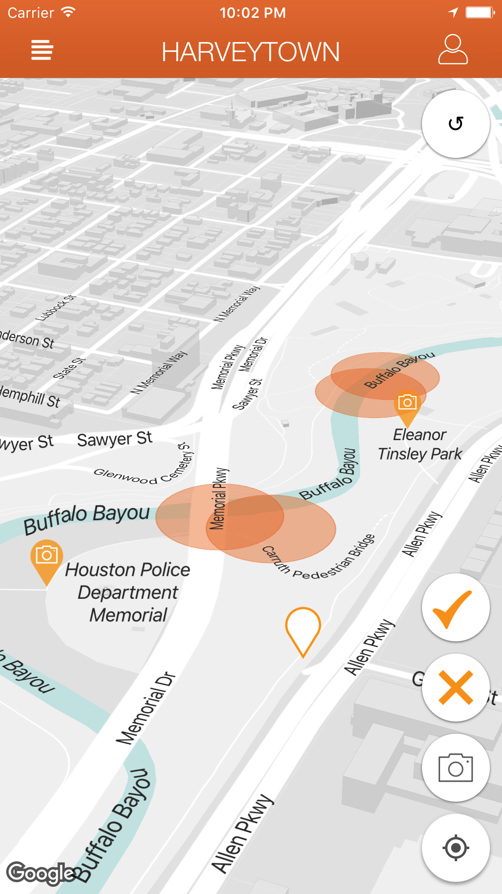

# Harvey

**UPDATE: As of February 2018, Harveytown is no longer actively running on either the website or iOS app.**

Harvey is the Swift package for the iOS app "Harveytown".

  
    
    
    
  

 

  
    
    
    
  

________________________________________________________________________
________________________________________________________________________
**As of December 2017, Hundreds of Southeast Texas families are still displaced from their homes due to Hurricane Harvey.**

Harveytown brings together volunteers and homeowners needing repairs:
* Volunteers can create a profile and specify their skill levels for various repair work.
* Homeowners add their home with photos of the damaged areas.
* Harveytown highlights which homes need repairs matching a volunteer's skill set, and provides a Facebook link to contact the homeowner to schedule repair times.

### Disaster relief takes a community!

________________________________________________________________________

## Developers:

Harveytown does not have a revenue stream, and relies on volunteers for maintanance and upgrades.  Feel free to push updates to this repo or the sibling repo for the website: https://github.com/TangoJ-Labs/HT-EB-HOST 
